# 🖼️ S3 Media Gallery - Architecture & Workflow

> A clean, professional documentation of how the S3 Media Gallery application works

---

## 🏗️ System Architecture

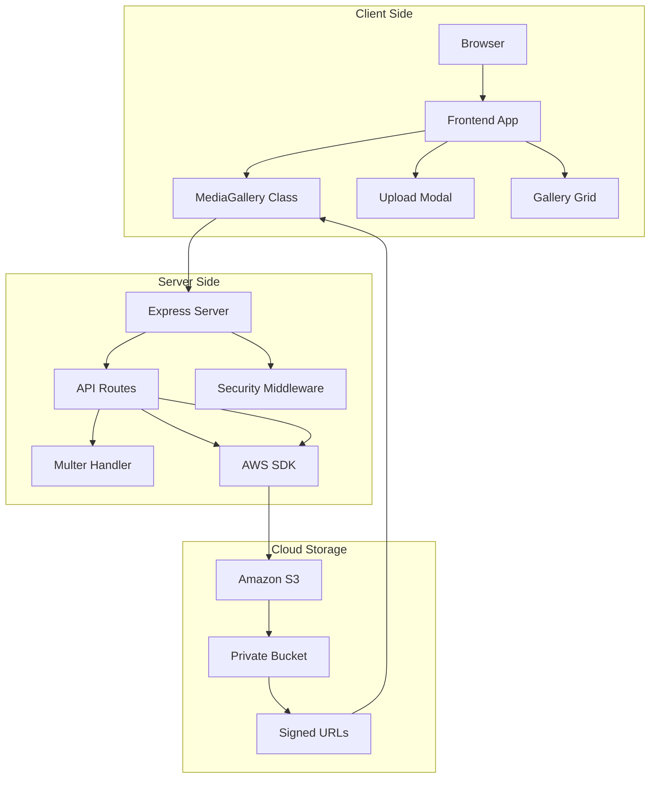
```mermaid
graph TB
    subgraph "Client Side"
        A[Browser] --> B[Frontend App]
        B --> C[MediaGallery Class]
        B --> D[Upload Modal]
        B --> E[Gallery Grid]
    end
    
    subgraph "Server Side"
        F[Express Server] --> G[API Routes]
        F --> H[Security Middleware]
        G --> I[Multer Handler]
        G --> J[AWS SDK]
    end
    
    subgraph "Cloud Storage"
        K[Amazon S3]
        L[Private Bucket]
        M[Signed URLs]
    end
    
    C --> F
    G --> J
    J --> K
    K --> L
    L --> M
    M --> C
```

---

## 🔄 Data Flow Overview

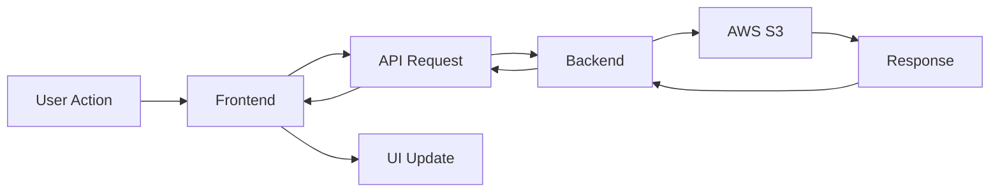
```mermaid
flowchart LR
    A[User Action] --> B[Frontend]
    B --> C[API Request]
    C --> D[Backend]
    D --> E[AWS S3]
    E --> F[Response]
    F --> D
    D --> C
    C --> B
    B --> G[UI Update]
```

---

## 📱 User Journey Flow

### 1. Page Load & Gallery Display

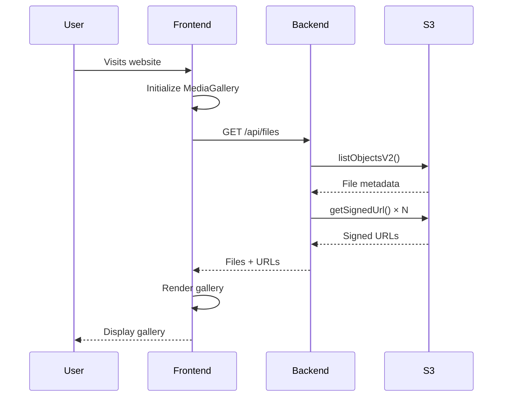
```mermaid
sequenceDiagram
    participant U as User
    participant F as Frontend
    participant B as Backend
    participant S as S3
    
    U->>F: Visits website
    F->>F: Initialize MediaGallery
    F->>B: GET /api/files
    B->>S: listObjectsV2()
    S-->>B: File metadata
    B->>S: getSignedUrl() × N
    S-->>B: Signed URLs
    B-->>F: Files + URLs
    F->>F: Render gallery
    F-->>U: Display gallery
```

### 2. File Upload Process

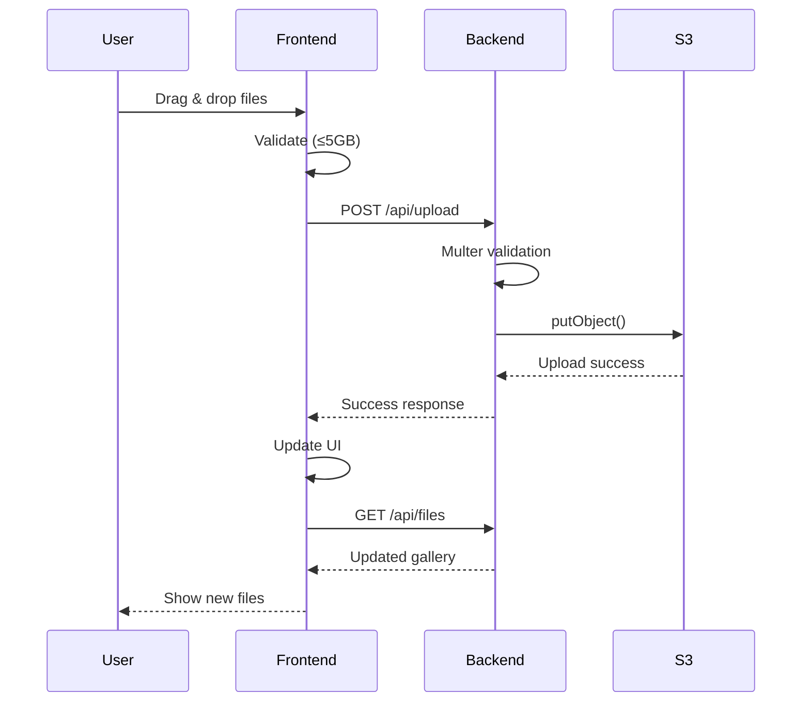
```mermaid
sequenceDiagram
    participant U as User
    participant F as Frontend
    participant B as Backend
    participant S as S3
    
    U->>F: Drag & drop files
    F->>F: Validate (≤5GB)
    F->>B: POST /api/upload
    B->>B: Multer validation
    B->>S: putObject()
    S-->>B: Upload success
    B-->>F: Success response
    F->>F: Update UI
    F->>B: GET /api/files
    B-->>F: Updated gallery
    F-->>U: Show new files
```

### 3. File Preview & Actions

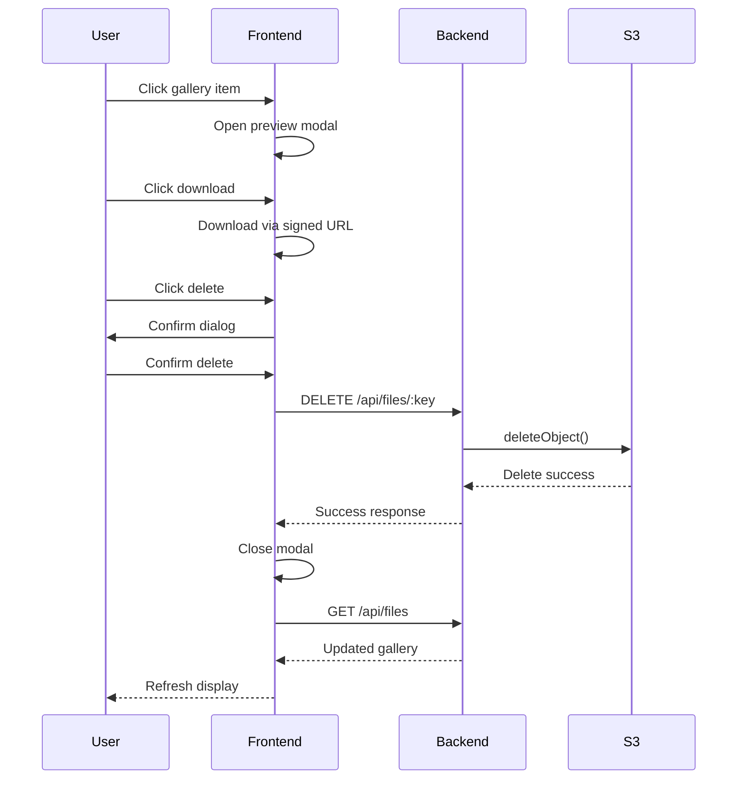
```mermaid
sequenceDiagram
    participant U as User
    participant F as Frontend
    participant B as Backend
    participant S as S3
    
    U->>F: Click gallery item
    F->>F: Open preview modal
    U->>F: Click download
    F->>F: Download via signed URL
    
    U->>F: Click delete
    F->>U: Confirm dialog
    U->>F: Confirm delete
    F->>B: DELETE /api/files/:key
    B->>S: deleteObject()
    S-->>B: Delete success
    B-->>F: Success response
    F->>F: Close modal
    F->>B: GET /api/files
    B-->>F: Updated gallery
    F-->>U: Refresh display
```

---

## 🔧 Technical Architecture

### Frontend Components

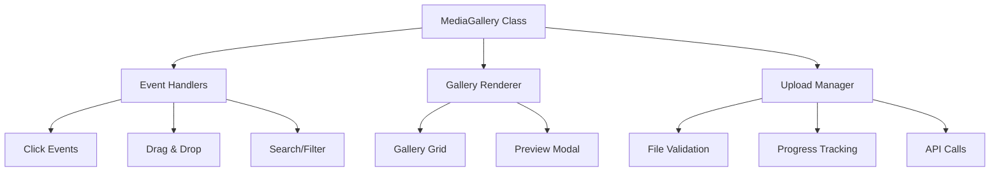
```mermaid
graph TD
    A[MediaGallery Class] --> B[Event Handlers]
    A --> C[Gallery Renderer]
    A --> D[Upload Manager]
    
    B --> E[Click Events]
    B --> F[Drag & Drop]
    B --> G[Search/Filter]
    
    C --> H[Gallery Grid]
    C --> I[Preview Modal]
    
    D --> J[File Validation]
    D --> K[Progress Tracking]
    D --> L[API Calls]
```

### Backend API Structure

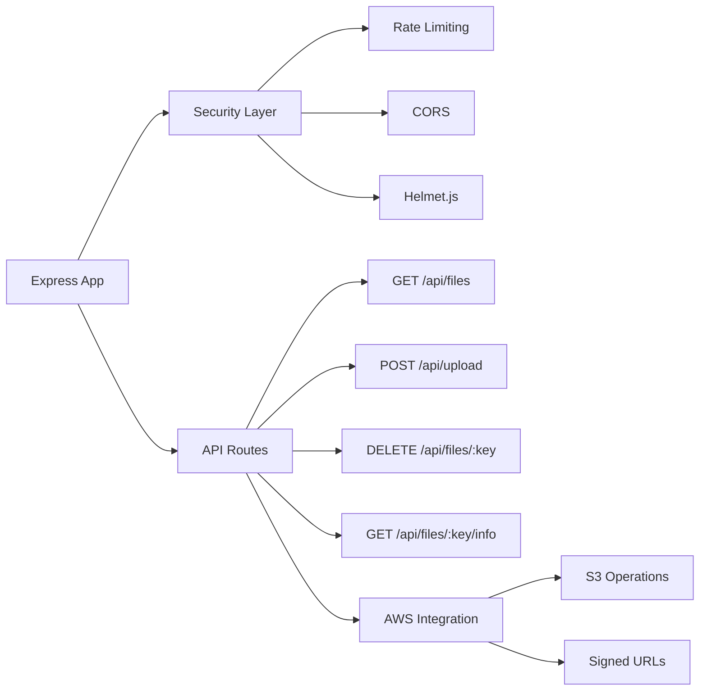
```mermaid
graph LR
    A[Express App] --> B[Security Layer]
    B --> C[Rate Limiting]
    B --> D[CORS]
    B --> E[Helmet.js]
    
    A --> F[API Routes]
    F --> G[GET /api/files]
    F --> H[POST /api/upload]
    F --> I[DELETE /api/files/:key]
    F --> J[GET /api/files/:key/info]
    
    F --> K[AWS Integration]
    K --> L[S3 Operations]
    K --> M[Signed URLs]
```

---

## 📊 File Storage Structure

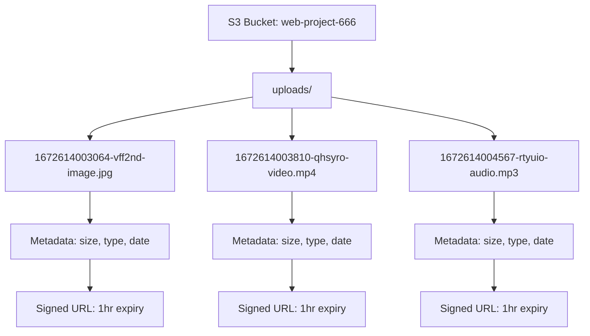
```mermaid
graph TD
    A[S3 Bucket: web-project-666] --> B[uploads/]
    
    B --> C[1672614003064-vff2nd-image.jpg]
    B --> D[1672614003810-qhsyro-video.mp4]
    B --> E[1672614004567-rtyuio-audio.mp3]
    
    C --> F[Metadata: size, type, date]
    D --> G[Metadata: size, type, date]
    E --> H[Metadata: size, type, date]
    
    F --> I[Signed URL: 1hr expiry]
    G --> J[Signed URL: 1hr expiry]
    H --> K[Signed URL: 1hr expiry]
```

**File Naming Convention:**
```
{timestamp}-{randomString}-{originalName}
```

---

## 🛡️ Security Flow

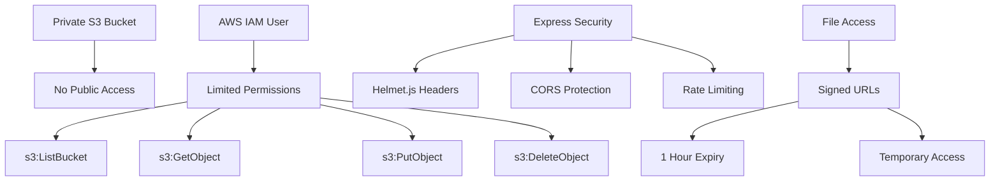
```mermaid
graph TB
    A[Private S3 Bucket] --> B[No Public Access]
    
    C[AWS IAM User] --> D[Limited Permissions]
    D --> E[s3:ListBucket]
    D --> F[s3:GetObject]
    D --> G[s3:PutObject]
    D --> H[s3:DeleteObject]
    
    I[Express Security] --> J[Helmet.js Headers]
    I --> K[CORS Protection]
    I --> L[Rate Limiting]
    
    M[File Access] --> N[Signed URLs]
    N --> O[1 Hour Expiry]
    N --> P[Temporary Access]
```

---

## 📱 Responsive Design Flow

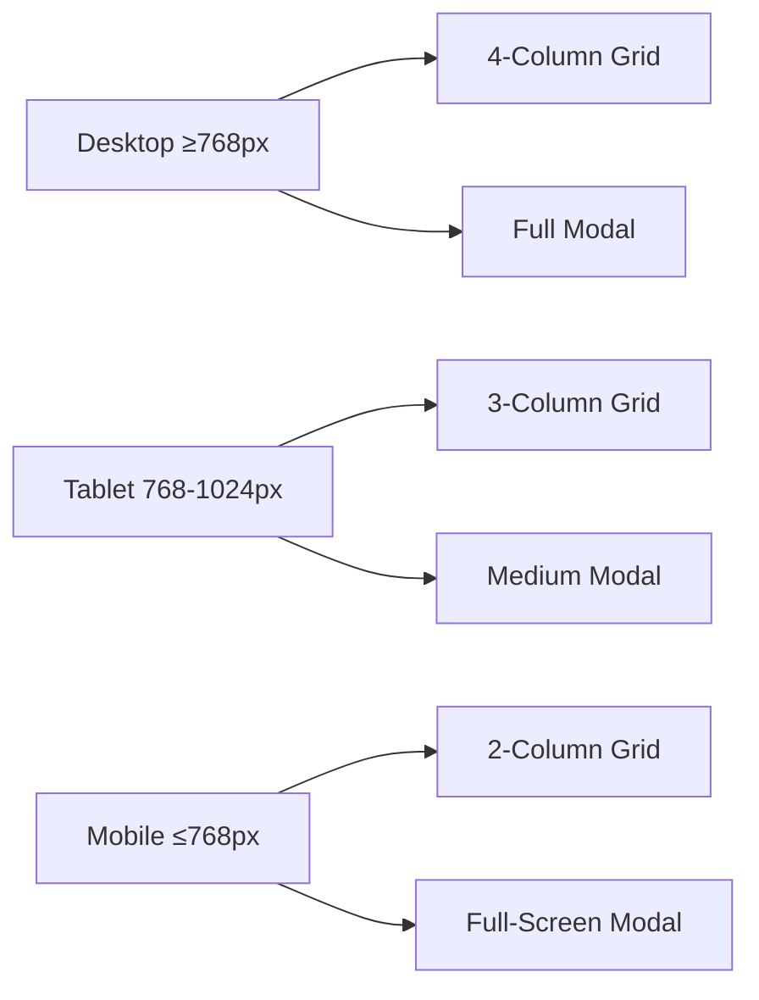
```mermaid
graph LR
    A[Desktop ≥768px] --> B[4-Column Grid]
    A --> C[Full Modal]
    
    D[Tablet 768-1024px] --> E[3-Column Grid]
    D --> F[Medium Modal]
    
    G[Mobile ≤768px] --> H[2-Column Grid]
    G --> I[Full-Screen Modal]
```

---

## 🔄 State Management Flow

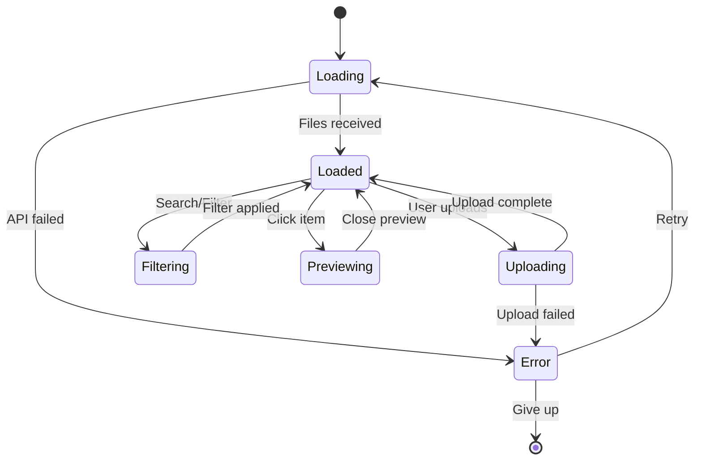
```mermaid
stateDiagram-v2
    [*] --> Loading
    Loading --> Loaded: Files received
    Loading --> Error: API failed
    
    Loaded --> Uploading: User uploads
    Loaded --> Filtering: Search/Filter
    Loaded --> Previewing: Click item
    
    Uploading --> Loaded: Upload complete
    Uploading --> Error: Upload failed
    
    Filtering --> Loaded: Filter applied
    Previewing --> Loaded: Close preview
    
    Error --> Loading: Retry
    Error --> [*]: Give up
```

---

## 🎯 Key Features Flow

### Upload Validation

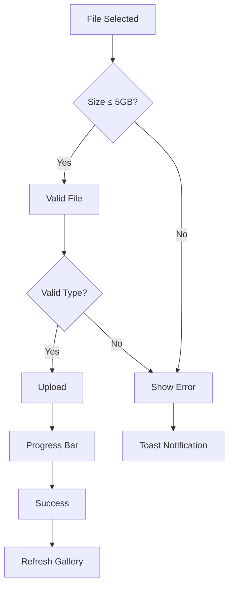
```mermaid
flowchart TD
    A[File Selected] --> B{Size ≤ 5GB?}
    B -->|Yes| C[Valid File]
    B -->|No| D[Show Error]
    
    C --> E{Valid Type?}
    E -->|Yes| F[Upload]
    E -->|No| D
    
    F --> G[Progress Bar]
    G --> H[Success]
    H --> I[Refresh Gallery]
    
    D --> J[Toast Notification]
```

### Search & Filter

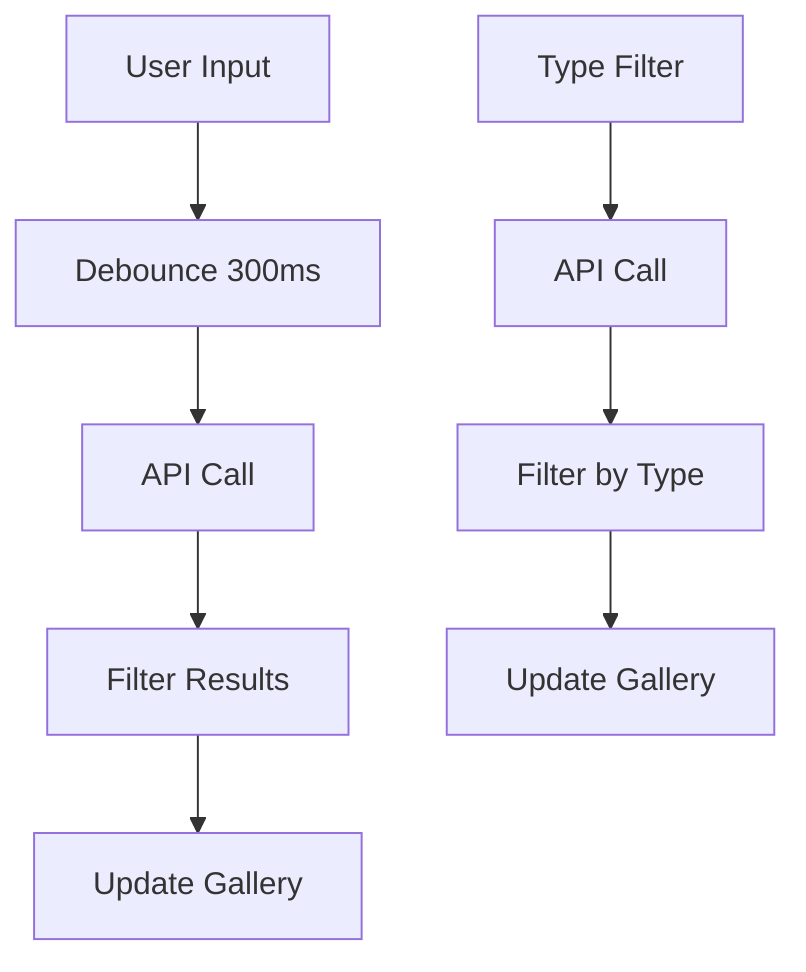
```mermaid
flowchart TD
    A[User Input] --> B[Debounce 300ms]
    B --> C[API Call]
    C --> D[Filter Results]
    D --> E[Update Gallery]
    
    F[Type Filter] --> G[API Call]
    G --> H[Filter by Type]
    H --> I[Update Gallery]
```

---

## 📋 API Request/Response Flow

### GET /api/files

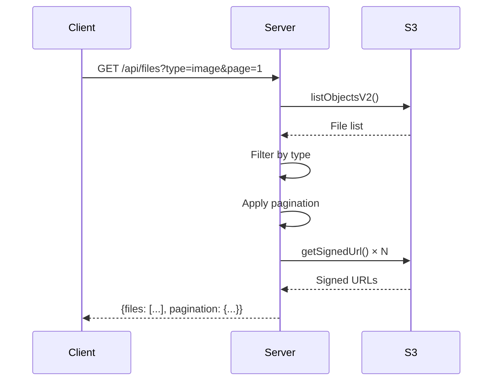
```mermaid
sequenceDiagram
    participant C as Client
    participant S as Server
    participant AWS as S3
    
    C->>S: GET /api/files?type=image&page=1
    S->>AWS: listObjectsV2()
    AWS-->>S: File list
    S->>S: Filter by type
    S->>S: Apply pagination
    S->>AWS: getSignedUrl() × N
    AWS-->>S: Signed URLs
    S-->>C: {files: [...], pagination: {...}}
```

### POST /api/upload

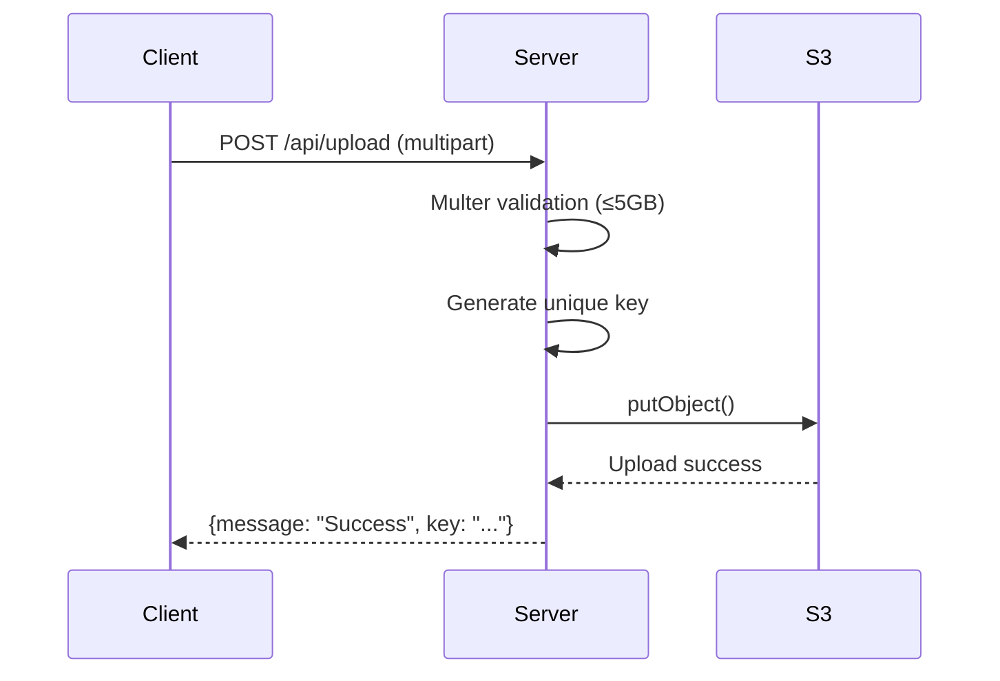
```mermaid
sequenceDiagram
    participant C as Client
    participant S as Server
    participant AWS as S3
    
    C->>S: POST /api/upload (multipart)
    S->>S: Multer validation (≤5GB)
    S->>S: Generate unique key
    S->>AWS: putObject()
    AWS-->>S: Upload success
    S-->>C: {message: "Success", key: "..."}
```

---

## 🚀 Performance Optimization

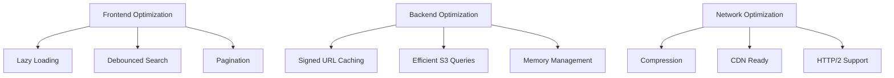
```mermaid
graph TB
    A[Frontend Optimization] --> B[Lazy Loading]
    A --> C[Debounced Search]
    A --> D[Pagination]
    
    E[Backend Optimization] --> F[Signed URL Caching]
    E --> G[Efficient S3 Queries]
    E --> H[Memory Management]
    
    I[Network Optimization] --> J[Compression]
    I --> K[CDN Ready]
    I --> L[HTTP/2 Support]
```

---

## 🎨 UI Component Hierarchy

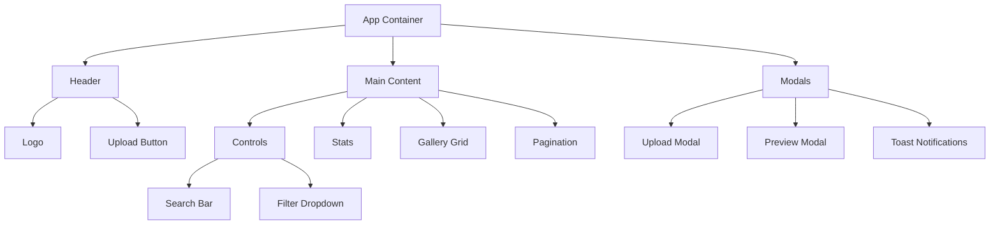
```mermaid
graph TD
    A[App Container] --> B[Header]
    A --> C[Main Content]
    A --> D[Modals]
    
    B --> E[Logo]
    B --> F[Upload Button]
    
    C --> G[Controls]
    C --> H[Stats]
    C --> I[Gallery Grid]
    C --> J[Pagination]
    
    G --> K[Search Bar]
    G --> L[Filter Dropdown]
    
    D --> M[Upload Modal]
    D --> N[Preview Modal]
    D --> O[Toast Notifications]
```

---

## 📊 File Type Support

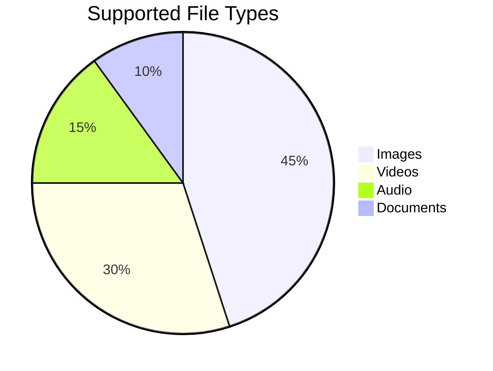
```mermaid
pie title Supported File Types
    "Images" : 45
    "Videos" : 30
    "Audio" : 15
    "Documents" : 10
```

**Supported Formats:**
- 🖼️ **Images**: JPG, PNG, GIF, WebP, SVG
- 🎬 **Videos**: MP4, AVI, MOV, WebM
- 🎵 **Audio**: MP3, WAV, OGG, FLAC
- 📄 **Documents**: PDF, DOC, TXT

---

## 🔍 Error Handling Flow

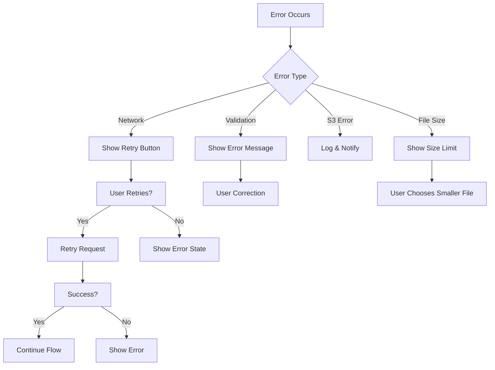
```mermaid
flowchart TD
    A[Error Occurs] --> B{Error Type}
    
    B -->|Network| C[Show Retry Button]
    B -->|Validation| D[Show Error Message]
    B -->|S3 Error| E[Log & Notify]
    B -->|File Size| F[Show Size Limit]
    
    C --> G[User Retries?]
    G -->|Yes| H[Retry Request]
    G -->|No| I[Show Error State]
    
    H --> J[Success?]
    J -->|Yes| K[Continue Flow]
    J -->|No| L[Show Error]
    
    D --> M[User Correction]
    F --> N[User Chooses Smaller File]
```

---

## 🎯 Quick Reference

### Core Components

| Component | Purpose | Key Method |
|-----------|---------|------------|
| `MediaGallery` | Main app class | `loadFiles()` |
| `Upload Modal` | File upload UI | `handleFileSelect()` |
| `Preview Modal` | Media display | `showPreview()` |
| `Gallery Grid` | File display | `renderGallery()` |

### API Endpoints

| Method | Endpoint | Purpose |
|--------|----------|---------|
| GET | `/api/files` | List files |
| POST | `/api/upload` | Upload file |
| DELETE | `/api/files/:key` | Delete file |
| GET | `/api/files/:key/info` | File info |

### File Limits

| Property | Value |
|----------|-------|
| Max File Size | 5GB |
| URL Expiry | 1 Hour |
| Rate Limit | 100 req/15min |
| Pagination | 50 files/page |

---

## 🚀 Getting Started

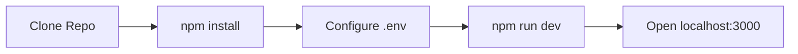
```mermaid
flowchart LR
    A[Clone Repo] --> B[npm install]
    B --> C[Configure .env]
    C --> D[npm run dev]
    D --> E[Open localhost:3000]
```

**Environment Variables:**
```env
AWS_ACCESS_KEY_ID=your_key
AWS_SECRET_ACCESS_KEY=your_secret
AWS_REGION=ap-south-1
S3_BUCKET_NAME=web-project-666
PORT=3000
```

---

## 📞 Support & Contributing

- 📧 **Issues**: GitHub Issues
- 🔄 **Pull Requests**: Welcome
- 📚 **Documentation**: This file
- 🚀 **Deployment**: See DEPLOYMENT.md

---

> **Built with ❤️ using Node.js, Express, AWS S3, and Vanilla JavaScript**
