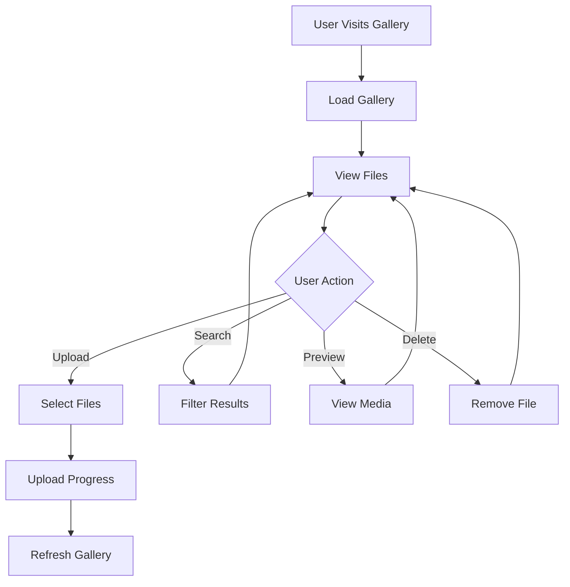

# 📚 S3 Media Gallery
## Architecture & Workflow Documentation

---

## 🏗️ System Architecture

```
┌─────────────────┐    ┌─────────────────┐    ┌─────────────────┐
│   Frontend      │    │   Backend       │    │   AWS S3        │
│   (Browser)     │◄──►│   (Node.js)     │◄──►│   (Cloud)       │
│                 │    │                 │    │                 │
│ • React-like UI │    • Express Server │    • Private Bucket │
│ • Drag & Drop   │    • Multer Upload  │    • Signed URLs   │
│ • Media Player  │    • AWS SDK v2     │    • File Storage  │
│ • Search/Filter│    • Rate Limiting  │    • ACL Control   │
└─────────────────┘    └─────────────────┘    └─────────────────┘
```

---

## 🔄 Data Flow Overview

### 📱 User Journey Flow



---

## 🚀 Core Workflows

### 1. 📂 **Gallery Initialization**

**Process Flow:**
```
🌐 Browser Request
   ↓
📄 Load Static Assets
   ↓
⚡ Initialize MediaGallery
   ↓
🔍 Fetch File List (GET /api/files)
   ↓
☁️ S3 List Objects
   ↓
🔐 Generate Signed URLs
   ↓
🎨 Render Gallery Grid
   ↓
✅ Ready for User Interaction
```

**Key Components:**
- **No Authentication** - Open access model
- **Shared Storage** - All users see same files
- **Signed URLs** - 1-hour temporary access
- **Pagination** - 50 files per page

---

### 2. ⬆️ **File Upload Process**

**Process Flow:**
```
🖱️ User Clicks Upload
   ↓
📂 Upload Modal Opens
   ↓
🎯 Select/Drag Files (≤5GB)
   ↓
✅ Client Validation
   ↓
📤 POST /api/upload
   ↓
🛡️ Multer Middleware
   ↓
💾 Memory Buffer
   ↓
🔑 Generate Unique Key
   ↓
☁️ S3 Put Object
   ↓
✅ Success Response
   ↓
🔄 Gallery Refresh
```

**Validation Rules:**
- ✅ **Size Limit**: 5GB maximum
- ✅ **File Types**: Images, Videos, Audio, Documents
- ✅ **Storage**: Memory buffer for performance
- ✅ **Naming**: `timestamp-random-originalName`

---

### 3. 👁️ **Media Preview Flow**

**Process Flow:**
```
🖱️ Click Gallery Item
   ↓
🖼️ Preview Modal Opens
   ↓
▶️ Load Media via Signed URL
   ↓
🎮 Media Controls Active
   ↓
🔧 User Options:
   • 📥 Download
   • 🗑️ Delete
   • ❌ Close
```

**Media Support:**
- 🖼️ **Images**: JPG, PNG, GIF, WebP, SVG
- 🎬 **Videos**: MP4, AVI, MOV, WebM
- 🎵 **Audio**: MP3, WAV, FLAC, AAC
- 📄 **Documents**: PDF, DOC, TXT (if supported)

---

### 4. 🔍 **Search & Filter Flow**

**Process Flow:**
```
🔍 User Types Search Query
   ↓
⏱️ Debounced Input (300ms)
   ↓
📡 GET /api/files?search=...
   ↓
☁️ S3 Filter Results
   ↓
🔄 Update Gallery Display
```

**Filter Options:**
- 🔍 **Text Search**: Filename matching
- 📁 **Type Filter**: Image/Video/Audio/All
- 📄 **Pagination**: Navigate pages
- 🔄 **Real-time**: Instant results

---

## 🔧 Technical Implementation

### 📡 **API Endpoints**

| Method | Endpoint | Description | Limit |
|--------|----------|-------------|-------|
| `GET` | `/api/files` | List files with pagination | 1000 files |
| `POST` | `/api/upload` | Upload file (≤5GB) | 5GB |
| `DELETE` | `/api/files/:key` | Delete file | - |
| `GET` | `/api/files/:key/info` | File metadata | - |
| `GET` | `/api/health` | Health check | - |

### 🔒 **Security Architecture**

```
🛡️ Security Layers
├── 🔒 Private S3 Bucket
│   └── 🔑 Signed URLs (1hr expiry)
├── 🛡️ Helmet.js Headers
│   └── 🌐 CSP, HSTS, XSS Protection
├── 🚦 CORS Control
│   └── 📍 Origin Restrictions
├── ⚡ Rate Limiting
│   └── 📊 100 req/15min per IP
└── 📏 File Size Limits
    └── 💾 5GB Maximum Upload
```

### 📁 **File Storage Structure**

```
📦 S3 Bucket: web-project-666
└── 📂 uploads/
    ├── 🖼️ 1672614003064-vff2nd-photo.jpg
    ├── 🎬 1672614003810-qhsyro-video.mp4
    ├── 🎵 1672614004567-rtyuio-audio.mp3
    └── 📄 1672614005234-ghjklm-document.pdf
```

**Naming Convention:**
- 🕐 **Timestamp**: Unix epoch for uniqueness
- 🎲 **Random**: 6-character string
- 📝 **Original**: Preserved filename
- 📂 **Location**: `uploads/` folder

---

## 🎨 Frontend Architecture

### 🏛️ **Component Structure**

```javascript
📦 MediaGallery Class
├── 🎯 Core Properties
│   ├── files: Array
│   ├── currentPage: Number
│   ├── currentFilter: String
│   └── currentSearch: String
├── 🔧 Core Methods
│   ├── loadFiles()
│   ├── renderGallery()
│   ├── showUploadModal()
│   └── handleFileSelect()
├── 🎨 UI Components
│   ├── Gallery Grid
│   ├── Upload Modal
│   ├── Preview Modal
│   └── Search/Filter
└── ⚡ Event Handlers
    ├── File Upload
    ├── Drag & Drop
    ├── Pagination
    └── Media Controls
```

### 🎯 **Key Features**

**Upload System:**
- 🎯 **Drag & Drop**: Intuitive file selection
- 📊 **Progress Tracking**: Visual upload indicators
- ✅ **Validation**: Client-side size checks
- 🔄 **Batch Upload**: Multiple files simultaneously

**Gallery Display:**
- 📱 **Responsive**: Adapts to screen size
- 🎨 **Grid Layout**: Clean card-based design
- 🔍 **Search**: Real-time filtering
- 📄 **Pagination**: Efficient navigation

**Media Player:**
- 🖼️ **Image Viewer**: Full-screen preview
- ▶️ **Video Player**: HTML5 video controls
- 🎵 **Audio Player**: HTML5 audio controls
- 📥 **Download**: Direct file download

---

## 🚀 Performance Optimization

### ⚡ **Frontend Optimizations**

```
🎯 Performance Strategies
├── 📦 Lazy Loading
│   └── 🖼️ Images load on demand
├── ⏱️ Debounced Search
│   └── 🔍 300ms input delay
├── 📄 Pagination
│   └── 📊 50 files per page
└── 🎨 Efficient Rendering
    └── ⚡ Virtual DOM updates
```

### 🛠️ **Backend Optimizations**

```
⚡ Backend Performance
├── 🗄️ S3 Optimization
│   ├── 📋 MaxKeys: 1000 per request
│   └── 🔑 Signed URL caching (1hr)
├── 💾 Memory Management
│   ├── 📊 Stream processing
│   └── 🗑️ Garbage collection
├── 🌐 Network Optimization
│   ├── 📦 Gzip compression
│   └── 🚀 Keep-alive connections
└── 📈 Scalability
    ├── ⚖️ Load balancing ready
    └── 🔄 Horizontal scaling
```

---

## 🔄 Error Handling

### 🚨 **Error Categories**

| Type | Example | Handling |
|------|---------|----------|
| 📡 **Network** | Connection failed | Retry button |
| 📤 **Upload** | File too large | Toast notification |
| 🔍 **Search** | No results found | Empty state message |
| 🗑️ **Delete** | Permission denied | Error toast |
| 🖼️ **Media** | File not found | Error placeholder |

### 💬 **User Feedback**

```
🎨 Feedback System
├── ✅ Success
│   └── 🎉 Green toast notifications
├── ❌ Error
│   └── 🔴 Red toast with details
├── ⏳ Loading
│   └── 🔄 Spinner animations
└── ℹ️ Info
    └── 💙 Blue informational messages
```

---

## 📊 Monitoring & Analytics

### 📈 **Key Metrics**

```
📊 Performance Metrics
├── 📤 Upload Success Rate
├── ⚡ Average Upload Time
├── 🔍 Search Query Frequency
├── 📱 User Engagement
└── 🗑️ File Deletion Rate
```

### 🔍 **Health Checks**

```
🏥 System Health
├── 💚 Server Status (GET /api/health)
├── ☁️ S3 Connectivity
├── 📊 Memory Usage
├── 🌐 API Response Time
└── 📈 Error Rate Monitoring
```

---

## 🚀 Deployment Architecture

### 🌐 **Production Setup**

```
🏗️ Production Stack
├── 🌐 Load Balancer
├── ⚡ Node.js Cluster
├── 🗄️ Database (Optional)
├── ☁️ AWS S3
├── 📊 CloudFront CDN
└── 📈 Monitoring
```

### 🔧 **Environment Variables**

```bash
# AWS Configuration
AWS_ACCESS_KEY_ID=your_key_here
AWS_SECRET_ACCESS_KEY=your_secret_here
AWS_REGION=ap-south-1
S3_BUCKET_NAME=web-project-666

# Server Configuration
PORT=3000
NODE_ENV=production
CORS_ORIGIN=https://yourdomain.com

# Security
RATE_LIMIT_WINDOW_MS=900000
RATE_LIMIT_MAX_REQUESTS=100
```

---

## 🎯 Future Enhancements

### 🚀 **Planned Features**

```
🎯 Roadmap
├── 👥 User Authentication
├── 📁 User-Specific Folders
├── 🎨 Theme Customization
├── 📊 Usage Analytics
├── 📱 Mobile App
├── 🔄 Real-time Updates
└── 🌐 Multi-region Support
```

### 🔧 **Technical Improvements**

```
⚡ Performance
├── 📦 Database Integration
├── 🗄️ Caching Layer
├── 🌐 CDN Implementation
└── 📈 Background Processing

🔒 Security
├── 👤 User Authentication
├── 🔐 File Encryption
├── 🛡️ Access Control
└── 📊 Audit Logging
```

---

## 📞 Support & Maintenance

### 🛠️ **Troubleshooting**

| Issue | Solution |
|-------|----------|
| 📤 Upload fails | Check file size (≤5GB) |
| 🔍 Search not working | Verify S3 connectivity |
| 🖼️ Images not loading | Check signed URL expiry |
| 📱 Mobile issues | Test responsive design |
| 🌐 CORS errors | Update origin settings |

### 📚 **Documentation Links**

- 📖 [README.md](./README.md) - Setup Guide
- 🚀 [DEPLOYMENT.md](./DEPLOYMENT.md) - Deployment Guide
- 🔑 [iam-policy.json](./iam-policy.json) - AWS Permissions
- 📦 [package.json](./package.json) - Dependencies

---

## 🎉 Conclusion

The S3 Media Gallery represents a modern, scalable solution for media management with:

- 🎨 **Beautiful UI** - Clean, responsive design
- ⚡ **High Performance** - Optimized for speed
- 🔒 **Secure** - Private bucket with signed URLs
- 📱 **User-Friendly** - Intuitive drag & drop
- 🚀 **Scalable** - Ready for production deployment

---

*Last Updated: March 2026*  
*Version: 1.0.0*  
*License: MIT*
